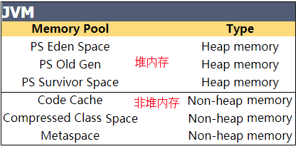

## 内存是如何分配的

这里所说的内存分配，主要指的是在堆上的分配，一般的，对象的内存分配都是在堆上进行，但现代技术也支持将对象拆成标量类型（标量类型即原子类型，表示单个值，可以是基本类型或String等），然后在栈上分配，在栈上分配的很少见，我们这里不考虑,接下来我们一起来了解下内存分区,对我们后面学习的有所帮助。

1、一个人（对象）出来（new 出来）后会在Eden Space（新生区）无忧无虑的生活，直到GC到来打破了他们平静的生活。GC会逐一问清楚每个对象的情况，有没有钱（此对象的引用）啊，因为GC想赚钱呀，有钱的才可以敲诈嘛。然后富人就会进入Survivor Space（幸存者区），穷人的就直接kill掉。

2、并不是进入Survivor Space（幸存者区）后就保证人身是安全的，但至少可以活段时间。GC会定期（可以自定义）会对这些人进行敲诈，亿万富翁每次都给钱，GC很满意，就让其进入了Old Gen(老年区)。万元户经不住几次敲诈就没钱了，GC看没有啥价值啦，就直接kill掉了。

3、进入到老年区的人基本就可以保证人身安全啦，但是亿万富豪有的也会挥霍成穷光蛋，只要钱没了，GC还是kill掉。

分区的目的：新生区由于对象产生的比较多并且大都是朝生夕灭的，所以直接采用标记-清理算法。而养老区生命力很强，则采用复制算法，针对不同情况使用不同算法。