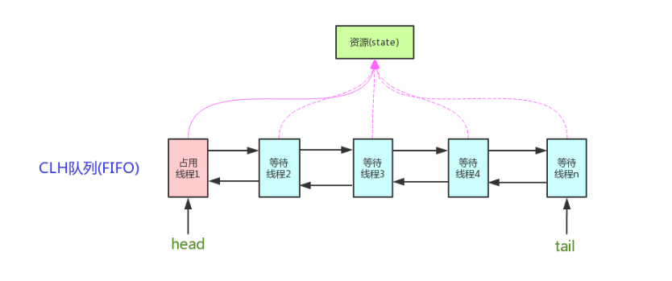

### AQS原理
AQS核心思想是，如果被请求的共享资源空闲，则将当前请求资源的线程设置为有效的工作线程，并且将共享资源设置为锁定状态。如果被请求的共享资源被占用，那么就需要一套线程阻塞等待以及被唤醒时锁分配的机制，这个机制AQS是用CLH队列锁实现的，即将暂时获取不到锁的线程加入到队列中。

>CLH(Craig,Landin,and Hagersten)队列是一个虚拟的双向队列（虚拟的双向队列即不存在队列实例，仅存在结点之间的关联关系）。AQS是将每条请求共享资源的线程封装成一个CLH锁队列的一个结点（Node）来实现锁的分配。


AQS使用一个int成员变量来表示同步状态，通过内置的FIFO队列来完成获取资源线程的排队工作。AQS使用CAS对该同步状态进行原子操作实现对其值的修改。
```java
private volatile int state;//共享变量，使用volatile修饰保证线程可见性
```
状态信息通过procted类型的getState，setState，compareAndSetState进行操作
```java
//返回同步状态的当前值
protected final int getState() {  
        return state;
}
 // 设置同步状态的值
protected final void setState(int newState) { 
        state = newState;
}
//原子地（CAS操作）将同步状态值设置为给定值update如果当前同步状态的值等于expect（期望值）
protected final boolean compareAndSetState(int expect, int update) {
        return unsafe.compareAndSwapInt(this, stateOffset, expect, update);
}
```
### AQS对资源的共享方式
Exclusive（独占）：只有一个线程能执行，如ReentrantLock。又可分为公平锁和非公平锁：

    公平锁：按照线程在队列中的排队顺序，先到者先拿到锁
    非公平锁：当线程要获取锁时，无视队列顺序直接去抢锁，谁抢到就是谁的
Share（共享）：多个线程可同时执行，如Semaphore/CountDownLatch。Semaphore、CountDownLatCh、 CyclicBarrier、ReadWriteLock 我们都会在后面讲到。


### AQS使用了模板方法模式，自定义同步器时需要重写下面几个AQS提供的模板方法：
```java
isHeldExclusively()//该线程是否正在独占资源。只有用到condition才需要去实现它。
tryAcquire(int)//独占方式。尝试获取资源，成功则返回true，失败则返回false。
tryRelease(int)//独占方式。尝试释放资源，成功则返回true，失败则返回false。
tryAcquireShared(int)//共享方式。尝试获取资源。负数表示失败；0表示成功，但没有剩余可用资源；正数表示成功，且有剩余资源。
tryReleaseShared(int)//共享方式。尝试释放资源，成功则返回true，失败则返回false。
```

以ReentrantLock为例，state初始化为0，表示未锁定状态。A线程lock()时，会调用tryAcquire()独占该锁并将state+1。此后，其他线程再tryAcquire()时就会失败，直到A线程unlock()到state=0（即释放锁）为止，其它线程才有机会获取该锁。当然，释放锁之前，A线程自己是可以重复获取此锁的（state会累加），这就是可重入的概念。但要注意，获取多少次就要释放多么次，这样才能保证state是能回到零态的。

再以CountDownLatch以例，任务分为N个子线程去执行，state也初始化为N（注意N要与线程个数一致）。这N个子线程是并行执行的，每个子线程执行完后countDown()一次，state会CAS(Compare and Swap)减1。等到所有子线程都执行完后(即state=0)，会unpark()主调用线程，然后主调用线程就会从await()函数返回，继续后余动作。

一般来说，自定义同步器要么是独占方法，要么是共享方式，他们也只需实现tryAcquire-tryRelease、tryAcquireShared-tryReleaseShared中的一种即可。但AQS也支持自定义同步器同时实现独占和共享两种方式，如ReentrantReadWriteLock。


### Semaphore(信号量)-允许多个线程同时访问
```java
public class SemaphoreExample1 {
    // 请求的数量
    private static final int threadCount = 550;

    public static void main(String[] args) throws InterruptedException {
        // 创建一个具有固定线程数量的线程池对象（如果这里线程池的线程数量给太少的话你会发现执行的很慢）
        ExecutorService threadPool = Executors.newFixedThreadPool(300);
        // 一次只能允许执行的线程数量。
        final Semaphore semaphore = new Semaphore(20);

        for (int i = 0; i < threadCount; i++) {
            final int threadnum = i;
            threadPool.execute(() -> {// Lambda 表达式的运用
                try {
                    semaphore.acquire(1);// 获取一个许可，所以可运行线程数量为20/1=20
                    /**
                     * 如果semaphore.acquire(1) 则一次可以20个线程在跑
                     * 如果semaphore.acquire(5) 则一次可以4个线程在跑
                     */
                    test(threadnum);
                    semaphore.release(1);// 释放一个许可
                } catch (InterruptedException e) {
                    // TODO Auto-generated catch block
                    e.printStackTrace();
                }

            });
        }
        threadPool.shutdown();
        System.out.println("finish");
    }

    public static void test(int threadnum) throws InterruptedException {
        Thread.sleep(1000);// 模拟请求的耗时操作
        System.out.println("threadnum:" + threadnum);
        Thread.sleep(1000);// 模拟请求的耗时操作
    }
}
```
执行 acquire 方法阻塞，直到有一个许可证可以获得然后拿走一个许可证；每个 release 方法增加一个许可证，这可能会释放一个阻塞的acquire方法。然而，其实并没有实际的许可证这个对象，Semaphore只是维持了一个可获得许可证的数量。 Semaphore经常用于限制获取某种资源的线程数量。

当然一次也可以一次拿取和释放多个许可，不过一般没有必要这样做：
```java
semaphore.acquire(5);// 获取5个许可，所以可运行线程数量为20/5=4
test(threadnum);
semaphore.release(5);// 获取5个许可，所以可运行线程数量为20/5=4
```
Semaphore 有两种模式，公平模式和非公平模式。

        公平模式： 调用acquire的顺序就是获取许可证的顺序，遵循FIFO；
        非公平模式： 抢占式的。
Semaphore 对应的两个构造方法如下：
```java
public Semaphore(int permits) {
sync = new NonfairSync(permits);
}

public Semaphore(int permits, boolean fair) {
sync = fair ? new FairSync(permits) : new NonfairSync(permits);
}
```

### CountDownLatch （倒计时器）
demo: com.example.demo.multiThread.CountDownLatchExample1

CountDownLatch 的三种典型用法

        ①某一线程在开始运行前等待n个线程执行完毕。将 CountDownLatch 的计数器初始化为n ：new CountDownLatch(n) ，每当一个任务线程执行完毕，就将计数器减1 countdownlatch.countDown()，当计数器的值变为0时，在CountDownLatch上 await() 的线程就会被唤醒。一个典型应用场景就是启动一个服务时，主线程需要等待多个组件加载完毕，之后再继续执行。

        ②实现多个线程开始执行任务的最大并行性。注意是并行性，不是并发，强调的是多个线程在某一时刻同时开始执行。类似于赛跑，将多个线程放到起点，等待发令枪响，然后同时开跑。做法是初始化一个共享的 CountDownLatch 对象，将其计数器初始化为 1 ：new CountDownLatch(1) ，多个线程在开始执行任务前首先 coundownlatch.await()，当主线程调用 countDown() 时，计数器变为0，多个线程同时被唤醒。

        ③死锁检测：一个非常方便的使用场景是，你可以使用n个线程访问共享资源，在每次测试阶段的线程数目是不同的，并尝试产生死锁。

CountDownLatch是一次性的，计数器的值只能在构造方法中初始化一次，之后没有任何机制再次对其设置值，当CountDownLatch使用完毕后，它不能再次被使用。

### CyclicBarrier(循环栅栏) 
demo: com.example.demo.multiThread.CyclicBarrierExample2
demo: com.example.demo.multiThread.CyclicBarrierExample3

CyclicBarrier 和 CountDownLatch 非常类似，它也可以实现线程间的技术等待，但是它的功能比 CountDownLatch 更加复杂和强大。主要应用场景和 CountDownLatch 类似。

概念

        CyclicBarrier 的字面意思是可循环使用（Cyclic）的屏障（Barrier）。它要做的事情是，让一组线程到达一个屏障（也可以叫同步点）时被阻塞，直到最后一个线程到达屏障时，屏障才会开门，所有被屏障拦截的线程才会继续干活。CyclicBarrier默认的构造方法是 CyclicBarrier(int parties)，其参数表示屏障拦截的线程数量，每个线程调用await方法告诉 CyclicBarrier 我已经到达了屏障，然后当前线程被阻塞。

应用场景

        CyclicBarrier 可以用于多线程计算数据，最后合并计算结果的应用场景。比如我们用一个Excel保存了用户所有银行流水，每个Sheet保存一个帐户近一年的每笔银行流水，现在需要统计用户的日均银行流水，先用多线程处理每个sheet里的银行流水，都执行完之后，得到每个sheet的日均银行流水，最后，再用barrierAction用这些线程的计算结果，计算出整个Excel的日均银行流水。

### CyclicBarrier和CountDownLatch的区别

对于CountDownLatch来说，重点是“一个线程（多个线程）等待”，而其他的N个线程在完成“某件事情”之后，可以终止，也可以等待。而对于CyclicBarrier，重点是多个线程，在任意一个线程没有完成，所有的线程都必须等待。

CountDownLatch是计数器，线程完成一个记录一个，只不过计数不是递增而是递减，而CyclicBarrier更像是一个阀门，需要所有线程都到达，阀门才能打开，然后继续执行。

CountDownLatch  | CyclicBarrier
--|:--:|--:
|减技术方式|加技术方式|
|线程|计算达到指定值时释放所有等待的线程|
|计算为0时无法重置|计算到指定值时，计数置为0重新开始|
|调用countDown()方法计数减1，调用await()方法只进行阻塞，对技术没有影响|调用await()方法计数+1，若加1后的值不等于构造方法的值，则线程阻塞|
|不可重复利用|可重复利用|

