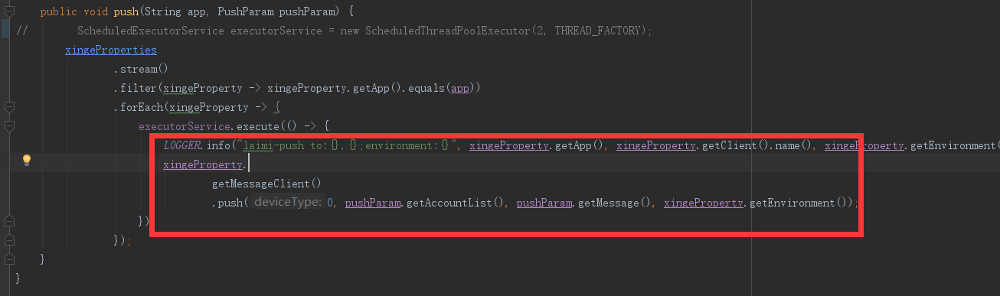

## ScheduledThreadPoolExecutor 吞异常

https://www.jianshu.com/p/b9bdbbdfc762

https://www.cnblogs.com/brolanda/p/4725138.htm


业务常见，比如抛了空指针异常，但是没有抛出来无法定位问题



Callable 和 Future接口的区别
+ Callable规定的方法是call()，而Runnable规定的方法是run()。
+ Callable的任务执行后可返回值，而Runnable的任务是不能返回值的。  
+ call()方法可抛出异常，而run()方法是不能抛出异常的。 
+ 运行Callable任务可拿到一个Future对象， Future表示异步计算的结果。 
+ 它提供了检查计算是否完成的方法，以等待计算的完成，并检索计算的结果。 
+ 通过Future对象可了解任务执行情况，可取消任务的执行，还可获取任务执行的结果。 
+ Callable是类似于Runnable的接口，实现Callable接口的类和实现Runnable的类都是可被其它线程执行的任务

## Callable与Runnable的区别：


Runnable
其中Runnable应该是我们最熟悉的接口，它只有一个run()函数，用于将耗时操作写在其中，该函数没有返回值。然后使用某个线程去执行该runnable即可实现多线程，Thread类在调用start()函数后就是执行的是Runnable的run()函数。Runnable的声明如下 :
```java
public interface Runnable {
    /*
     * @see     java.lang.Thread#run()
     */
    public abstract void run();
}
```

Callable
Callable与Runnable的功能大致相似，Callable中有一个call()函数，但是call()函数有返回值，而Runnable的run()函数不能将结果返回给客户程序。Callable的声明如下 :可以看到，这是一个泛型接口，call()函数返回的类型就是客户程序传递进来的V类型。
```java
public interface Callable<V> {
    /**
     * Computes a result, or throws an exception if unable to do so.
     *
     * @return computed result
     * @throws Exception if unable to compute a result
     */
    V call() throws Exception;
}
```
Future
Executor就是Runnable和Callable的调度容器，Future就是对于具体的Runnable或者Callable任务的执行结果进行

取消、查询是否完成、获取结果、设置结果操作。get方法会阻塞，直到任务返回结果(Future简介)。Future声明如下 :
```java
public interface Future<V> {
 
    /**
     * Attempts to cancel execution of this task.  This attempt will
     * fail if the task has already completed, has already been cancelled,
     * or could not be cancelled for some other reason. If successful,
     * and this task has not started when <tt>cancel</tt> is called,
     * this task should never run.  If the task has already started,
     * then the <tt>mayInterruptIfRunning</tt> parameter determines
     * whether the thread executing this task should be interrupted in
     * an attempt to stop the task.
     */
    boolean cancel(boolean mayInterruptIfRunning);
 
    /**
     * Returns <tt>true</tt> if this task was cancelled before it completed
     * normally.
     */
    boolean isCancelled();
 
    /**
     * Returns <tt>true</tt> if this task completed.
     *
     */
    boolean isDone();
 
    /**
     * Waits if necessary for the computation to complete, and then
     * retrieves its result.
     *
     * @return the computed result
     */
    V get() throws InterruptedException, ExecutionException;
 
    /**
     * Waits if necessary for at most the given time for the computation
     * to complete, and then retrieves its result, if available.
     *
     * @param timeout the maximum time to wait
     * @param unit the time unit of the timeout argument
     * @return the computed result
     */
    V get(long timeout, TimeUnit unit)
        throws InterruptedException, ExecutionException, TimeoutException;
}

```

