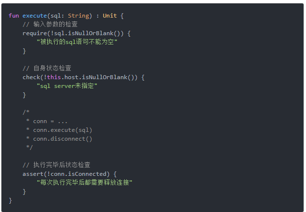

require对外、check对内，组成了协议的前置条件
assert是协议的后置条件

IllegalArgumentException: 传入的参数有问题
IllegalStateException：自身状态不对
AssertionError：和预估的不一样 （在后置条件的维基百科中其实就是这么定义的）
Postconditions are sometimes tested using assertions within the code itself

