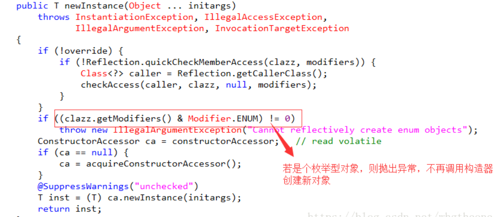

### 实现单例模式的方式


1 双重检查锁定示例

双重检查锁定背后的理论是完美的。不幸地是，现实完全不同。双重检查锁定的问题是：并不能保证它会在单处理器或多处理器计算机上顺利运行。

双重检查锁定失败的问题并不归咎于 JVM 中的实现 bug，而是归咎于 Java 平台内存模型。内存模型允许所谓的“无序写入”，这也是这些习语失败的一个主要原因。


```java
public class Singleton {  
    private volatile static Singleton singleton;  
    private Singleton (){}  
    public static Singleton getSingleton() {  
    if (singleton == null) {  
        synchronized (Singleton.class) {  
        if (singleton == null) {  
            singleton = new Singleton();  
            //new Singleton() 在jvm做了三件事 顺序颠倒 会返回一个部分初始化的singleton对象 所以会出现问题
        }  
        }  
    }  
    return singleton;  
    }  
}

```


2 静态内部类单例模式

```java
public class Singleton { 
    private Singleton(){
    }
      public static Singleton getInstance(){  
        return SingletonHolder.sInstance;  
    }  
    private static class SingletonHolder {  
        private static final Singleton sInstance = new Singleton();  
    }  
}

```


3 使用容器实现单例模式

```java
public class SingletonManager { 
　　private static Map<String, Object> objMap = new HashMap<String,Object>();
　　private Singleton() { 
　　}
　　public static void registerService(String key, Objectinstance) {
　　　　if (!objMap.containsKey(key) ) {
　　　　　　objMap.put(key, instance) ;
　　　　}
　　}
　　public static ObjectgetService(String key) {
　　　　return objMap.get(key) ;
　　}
}

```


## 为什么说m枚举是单例模式的最佳实现

https://blog.csdn.net/whgtheone/article/details/82990139

    创建对象的方式： new 克隆 序列化 反射

    因为构造方法是私有的，所以不能new
    克隆是不会执行构造函数的
    序列化会生成一个新的对象(可以跟代码)
    反射打破一切封装,也是拿到一个新的对象

枚举类型防止反序列化创建新对象原理：

        枚举对象的序列化、反序列化有自己的一套机制。序列化时，仅仅是将枚举对象的name属性输出到结果中，反序列化的时候则是通过java.lang.Enum的valueOf()方法来根据名字查找枚举对象

        通过过反射机制不会创建新的枚举对象的原因就比较简单了，直接从Constructor类源码中便可看出

 


使用readResolve方法解决反序列化及其弊端

    其实如果不使用枚举类实现单例，还有一种方法可以“保证”反序列化安全，那就是在类中类定一个readResolve方法，那么在反序列化之后，新建对象上的readResolve方法就会被调用。然后，该方法返回的对象引用将被返回，取代新建的对象（新建的对象也就是反序列化新生成的对象）。