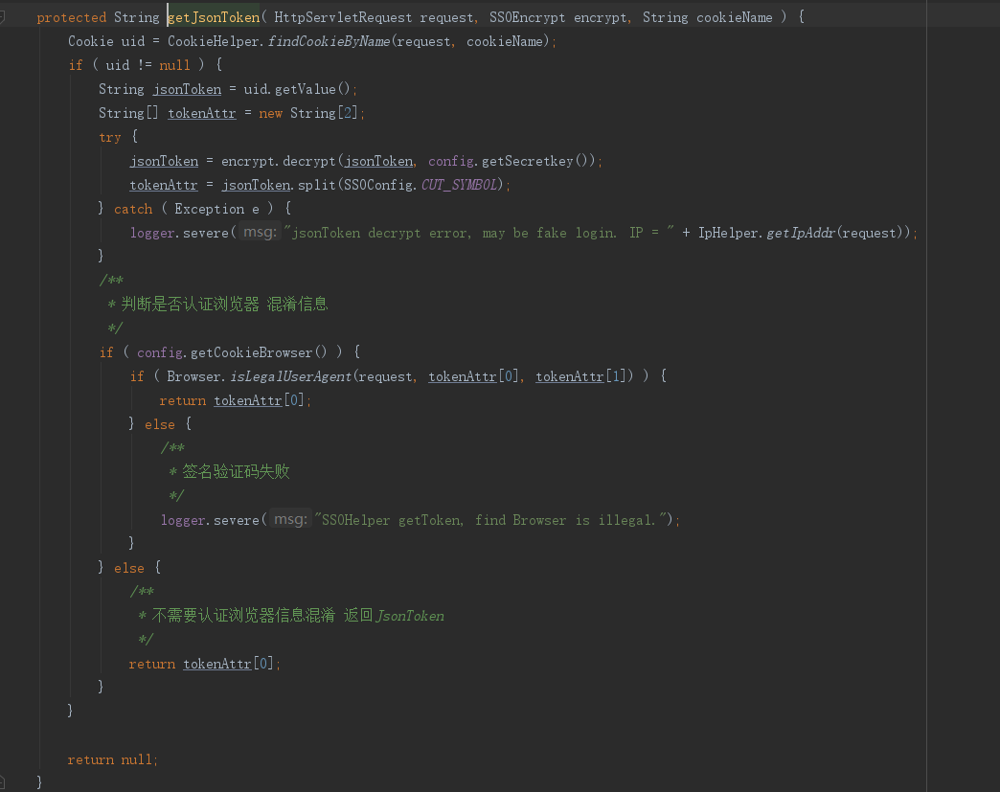

## 20181026 cookie问题

tms的sso 配置 cookieBrowser = false (默认配置)

    注意：cookieBrowser默认为true setCookie的时候会戴上浏览器信息；否则随机8位数字

erp登陆后（cookieBrowser = true）,保存了.51dinghuo.cc带有agent信息的cookie
tms登陆后（cookieBrowser = false）,更新域名.51dinghuo.cc对应的cookie,保存了带有随机数信息的cookie


所以下一次 erp发起请求，带上的cookie 就是tms的cookie(没有agent,只有8位随机数) -> 

erp解析失败，解析不到有agent的cookie

        SSOHelper.getToken ->

        --getTokenFromCookie

        -- getJsonToken



```java
	/**
	 * <p>
	 * 请求浏览器是否合法 (只校验客户端信息不校验domain)
	 * </p>
	 * @param request
	 * @param userAgent
	 *            浏览器客户端信息
	 * @return
	 */
	public static boolean isLegalUserAgent(HttpServletRequest request, String value, String userAgent) {
		String rlt = getUserAgent(request, value);

		if (rlt.equalsIgnoreCase(userAgent)) {
			logger.fine("Browser isLegalUserAgent is legal. Browser getUserAgent:" + rlt);
			return true;
		}

		logger.fine("Browser isLegalUserAgent is illegal. Browser getUserAgent:" + rlt);
		return false;
	}
```