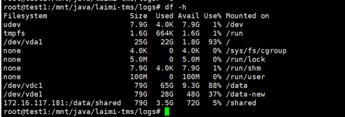
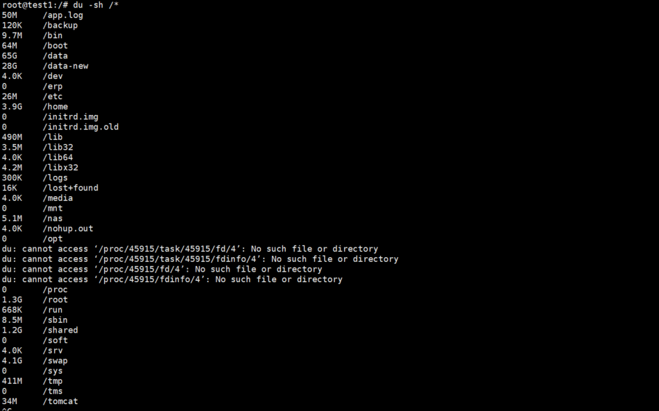
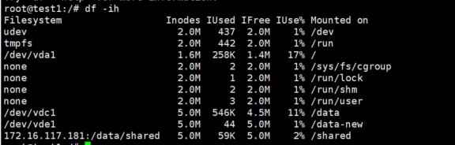
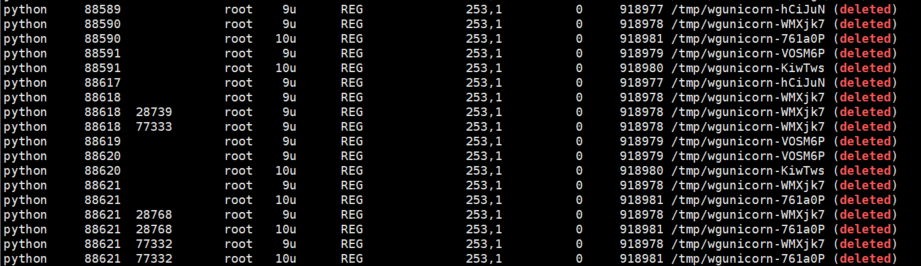

## Linux中出现“No space left on device”错误的排查与解决方法

由于磁盘空间被占满了，导致无法创建新文件。正常情况下，删除一些文件来释放空间，即可解决该问题。

思考步骤

1 使用 df 命令查看分区情况： df -h

2 查看了各目录的占用情况 ： du -sh /*

ps:

    很可能是小文件过多，导致 inode 急剧增加，消耗完 inode 区域的空间。如果真是如此，那么即使磁盘空间有剩余，但由于无法创建新的 inode 来存储文件的元信息，也就无法创建新文件。可以用 df -ih  验证

3  lsop 命令查看了被进程占用中的文件：lsof | grep deleted | grep tms

    可能存在已删除了文件，但是没有释放空间的情况；比如删除日志；找到了再kill掉就可以了

