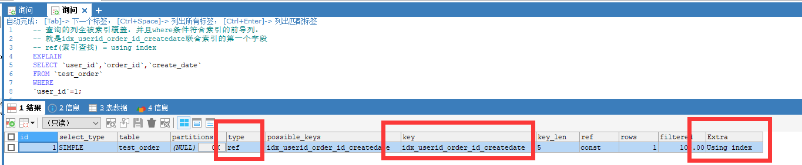
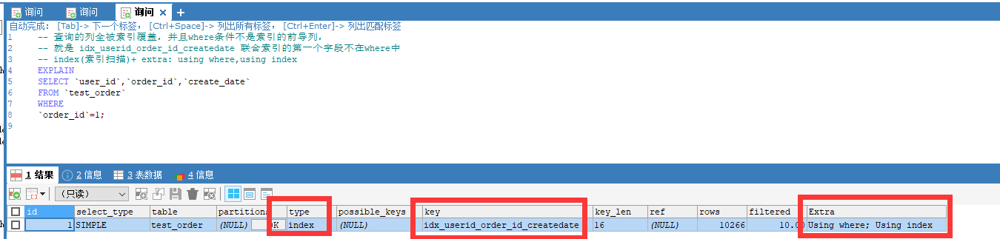
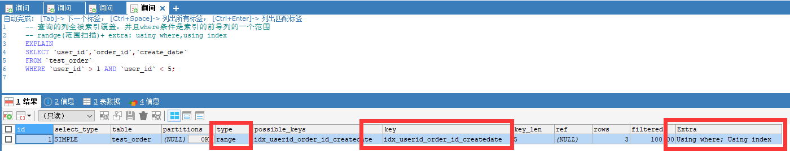
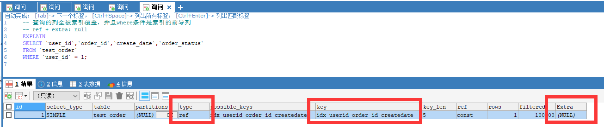
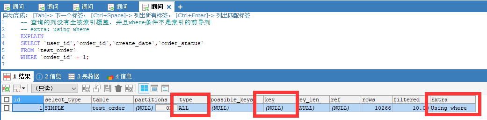
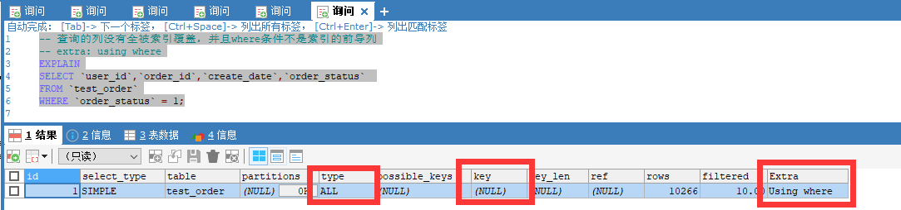
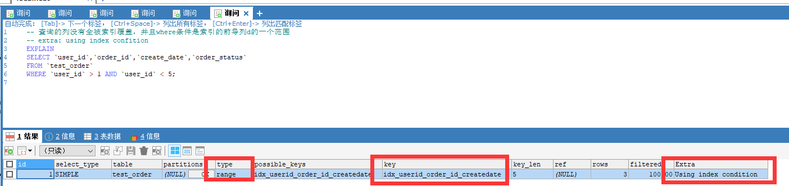
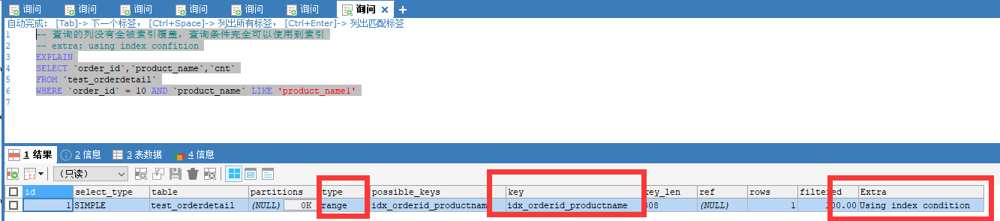

## explain索引学习

>基础数据准备

```sql
create table test_order
(
    id int auto_increment primary key,
    user_id int,
    order_id int,
    order_status tinyint,
    create_date datetime
);

create table test_orderdetail
(
    id int auto_increment primary key,
    order_id int,
    product_name varchar(100),
    cnt int,
    create_date datetime
);

create index idx_userid_order_id_createdate on test_order(user_id,order_id,create_date);

create index idx_orderid_productname on test_orderdetail(order_id,product_name);


DELIMITER ;;
CREATE PROCEDURE myproc3 ()

BEGIN
DECLARE num INT ;
SET num = 1 ;
WHILE num < 10000 DO
        INSERT INTO test_order (user_id,order_id,order_status,create_date) VALUES 
                (num,num,1,DATE_ADD(NOW(), INTERVAL - RAND()*20000 HOUR));
        INSERT INTO test_orderdetail(order_id,product_name,cnt,create_date) VALUES (num,CONCAT("product_name", num),RAND()*10,DATE_ADD(NOW(), INTERVAL - RAND()*20000 HOUR));
SET num = num + 1 ;
END
WHILE ;

END;;

CALL myproc3();`
```

>Using index 

  查询的列被索引覆盖，并且where筛选条件是索引的是前导列，Extra中为Using index

  

>Using where Using index

   1，查询的列被索引覆盖，并且where筛选条件是索引列之一但是不是索引的不是前导列，Extra中为Using where; Using index 意味着无法直接通过索引查找来查询到符合条件的数据

   

   2，查询的列被索引覆盖，并且where筛选条件是索引列前导列的一个范围，同样意味着无法直接通过索引查找查询到符合条件的数据

   

>NULL（既没有Using index，也没有Using where Using index，也没有using where）

　　1，查询的列未被索引覆盖，并且where筛选条件是索引的前导列，意味着用到了索引，但是部分字段未被索引覆盖，必须通过“回表”   来实现，不是纯粹地用到了索引，也不是完全没用到索引，Extra中为NULL(没有信息)

   


>Using where
   
   1，查询的列未被索引覆盖，where筛选条件非索引的前导列，Extra中为Using where

   

   2，查询的列未被索引覆盖，where筛选条件非索引列，Extra中为Using where

   

   using where 意味着通过索引或者表扫描的方式进程where条件的过滤，反过来说，也就是没有可用的索引查找，当然这里也要考虑索引扫描+回表与表扫描的代价。这里的type都是all，说明MySQL认为全表扫描是一种比较低的代价。

> Using index condition

　　1，查询的列不全在索引中，where条件中是一个前导列的范围

   

   2，查询列不完全被索引覆盖，查询条件完全可以使用到索引（进行索引查找）

   