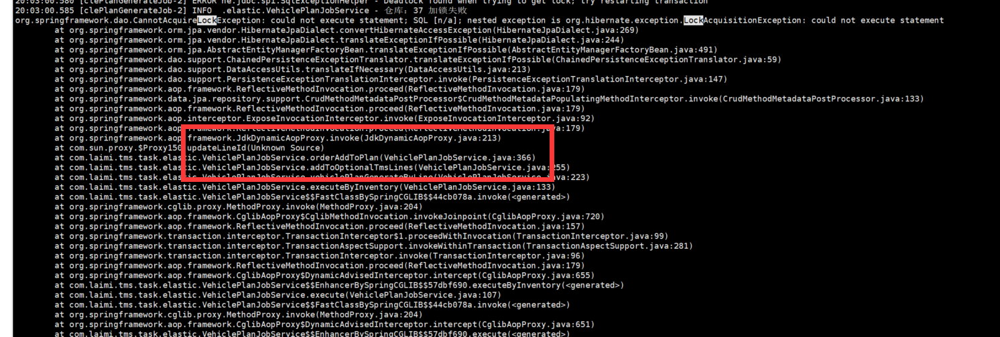
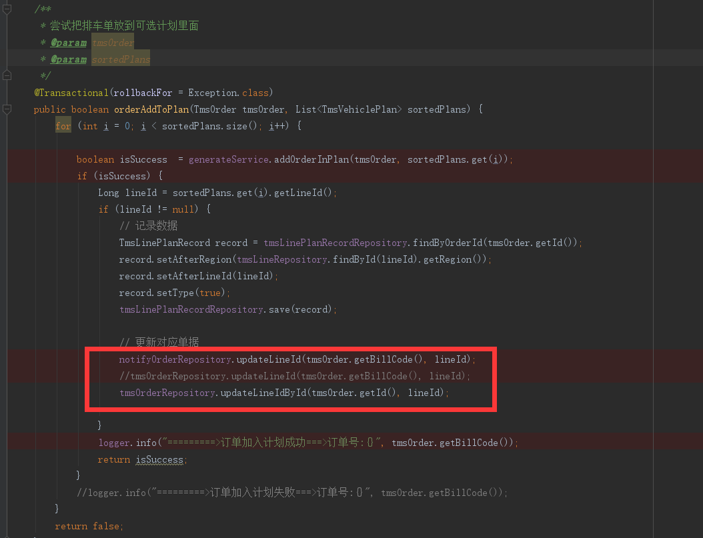

## 执行排车出现死锁问题

订单排车后，需要更新线路id 到对应的派车单;

定位问题出现的具体方法：

额外补充：https://www.cnblogs.com/luojianqun/p/6511725.html

mysql的事务支持与存储引擎有关，MyISAM不支持事务，INNODB支持事务，更新时采用的是行级锁。这里采用的是INNODB做存储引擎，意味着会将update语句做为一个事务来处理。前面提到行级锁必须建立在索引的基础，这条更新语句用到了索引，所以这里肯定会加上行级锁。 行级锁并不是直接锁记录，而是锁索引，如果一条SQL语句用到了主键索引，mysql会锁住主键索引；如果一条语句操作了非主键索引，mysql会先锁住非主键索引，再锁定主键索引。 

这个update语句会执行以下步骤：

    1、由于用到了非主键索引，首先需要获取普通索引上的行级锁 
    2、紧接着根据主键进行更新，所以需要获取主键上的行级锁； 、
    3、更新完毕后，提交，并释放所有锁。

如果在步骤1和2之间突然插入一条语句：UPDATE coupon SET coup num usr = coup num usr + 1 WHERE coup usr = ? AND specid = ? AND coup num usr < ?

就会发生死锁的情况，因为一条语句获取了普通索引的锁，等待主键锁，另外一条语句获取了主键锁，等待非主键索引，这样就出现了死锁.

如何来解决update ... where ...语句的死锁问题呢？我们可以对其进行分离，首先利用where条件找到主键，然后再利用这些主键去更新数据。

因为select * where ...语句是没有锁的，所以不存在会锁上where条件里面的字段，也就不会发生死锁的情况，只有在update的时候回锁上主键。

汇总：

    在采用INNODB的MySQL中，更新操作默认会加行级锁，行级锁是基于索引的，在分析死锁之前需要查询一下mysql的执行计划，看看是否用到了索引，用到了哪个索引，对于没有用索引的操作会采用表级锁。如果操作用到了主键索引会先在主键索引上加锁，然后在其他索引上加锁，否则加锁顺序相反。在并发度高的应用中，批量更新一定要带上记录的主键，优先获取主键上的锁，这样可以减少死锁的发生。