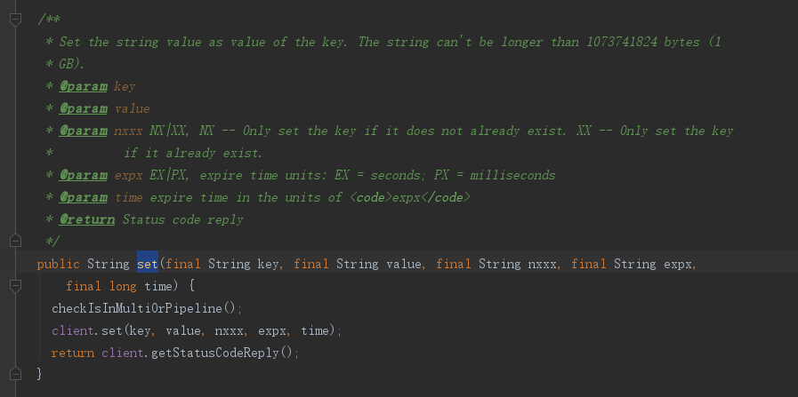

https://www.cnblogs.com/linjiqin/p/8003838.html

## redis分布式锁

常规 

1 上锁的过程
```java 

    RedisLock lock = new RedisLock(redisTemplate, String.format(RedisKey.VEHICLE_INV_PLAN_LOCK, inv.getInventoryId()));

    try{

        if (!lock.lock()) {
                logger.info((String.format("仓库ID: %s 获取锁失败，自动排车操作停止!", inv.getInventoryId())));
                return;
        }

    } catch (Exception e) {
        logger.info(String.format("仓库：%s 加锁失败", inv.getInventoryId()), e);
        throw new BusinessException(String.format("仓库:%s自动排车失败,回滚",inv.getInventoryId()));
    }finally {
        lock.unlock();
    }

```

2 lock() 加锁方法

``` java
    /**
     * 获得 lock.
     * 实现思路: 主要是使用了redis 的setnx命令,缓存了锁.
     * reids缓存的key是锁的key,所有的共享, value是锁的到期时间(注意:这里把过期时间放在value了,没有时间上设置其超时时间)
     * 执行过程:
     * 1.通过setnx尝试设置某个key的值,成功(当前没有这个锁)则返回,成功获得锁
     * 2.锁已经存在则获取锁的到期时间,和当前时间比较,超时的话,则设置新的值
     *
     * @return true if lock is acquired, false acquire timeouted
     * @throws InterruptedException in case of thread interruption
     */
    public synchronized boolean lock() throws InterruptedException {
//        int timeout = timeoutMsecs;

        long expires = System.currentTimeMillis() + expireMsecs + 1;
        String expiresStr = String.valueOf(expires); //锁到期时间
        if (this.setNX(lockKey, expiresStr)) {
            // lock acquired
            locked = true;
            return true;
        }

        String currentValueStr = this.get(lockKey); //redis里的时间
        if (currentValueStr != null && Long.parseLong(currentValueStr) < System.currentTimeMillis()) {
            //判断是否为空，不为空的情况下，如果被其他线程设置了值，则第二个条件判断是过不去的
            // lock is expired

            String oldValueStr = this.getSet(lockKey, expiresStr);
            //获取上一个锁到期时间，并设置现在的锁到期时间，
            //只有一个线程才能获取上一个线上的设置时间，因为jedis.getSet是同步的
            if (oldValueStr != null && oldValueStr.equals(currentValueStr)) {
                //防止误删（覆盖，因为key是相同的）了他人的锁——这里达不到效果，这里值会被覆盖，但是因为什么相差了很少的时间，所以可以接受

                //[分布式的情况下]:如过这个时候，多个线程恰好都到了这里，但是只有一个线程的设置值和当前值相同，他才有权利获取锁
                // lock acquired
                locked = true;
                return true;
            }
        }

//        timeout -= DEFAULT_ACQUIRY_RESOLUTION_MILLIS;

            /*
                延迟100 毫秒,  这里使用随机时间可能会好一点,可以防止饥饿进程的出现,即,当同时到达多个进程,
                只会有一个进程获得锁,其他的都用同样的频率进行尝试,后面有来了一些进行,也以同样的频率申请锁,这将可能导致前面来的锁得不到满足.
                使用随机的等待时间可以一定程度上保证公平性
             */
//        Thread.sleep(DEFAULT_ACQUIRY_RESOLUTION_MILLIS);

//        while (timeout >= 0) {
//
//        }
        return false;
    }
```

切面分布式锁


利用jedis提供的redis.clients.jedis.Jedis#set(java.lang.String, java.lang.String, java.lang.String, java.lang.String, long)

