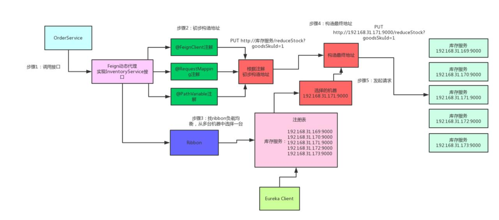
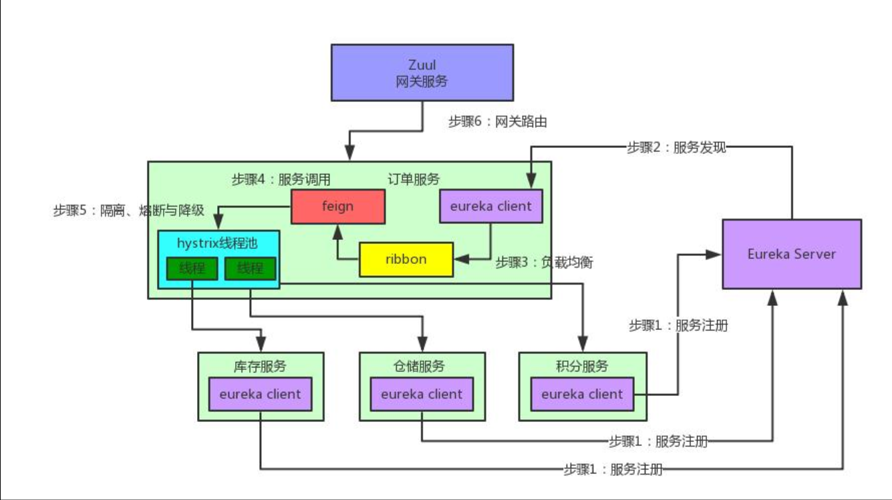

1. 首先，用户调用 Feign 创建的动态代理。
2. 然后，Feign 调用 Ribbon 发起调用流程。

    - 首先，Ribbon 会从 Eureka Client 里获取到对应的服务列表。
    - 然后，Ribbon 使用负载均衡算法获得使用的服务。
    - 最后，Ribbon 调用对应的服务。最后，Ribbon 调用 Feign ，而 Feign 调用 HTTP 库最终调用使用的服务。

这可能是比较绕的，艿艿自己也困惑了一下，后来去请教了下 didi 。因为 Feign 和 Ribbon 都存在使用 HTTP 库调用指定的服务，那么两者在集成之后，必然是只能保留一个。比较正常的理解，也是保留 Feign 的调用，而 Ribbon 更纯粹的只负责负载均衡的功能。

## 如下是 Eureka + Ribbon + Feign + Hystrix + Zuul 整合后的图
