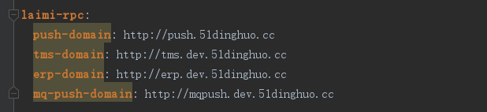
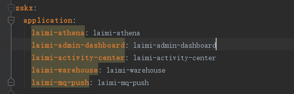

## Feign 接口使用

> 配置依赖使用

```
<dependency>
    <groupId>org.springframework.cloud</groupId>
    <artifactId>spring-cloud-starter-feign</artifactId>
</dependency>
```
在启动类上加@EnableFeignClients注解，如果你的Feign接口定义跟你的启动类不在一个包名下，还需要制定扫描的包名@EnableFeignClients(basePackages = "com.fangjia.api.client")

> 如果项目没有接入springCloud

配置文件



代码实现
```java
@FeignClient(value = "laimi-mq-push", url = "\${laimi-rpc.mq-push-domain}")
interface MqPushRPCService{

    /**
     * 发送常规消息
     * @param mqEntity
     * @return
     */
    @PostMapping("/dispatch/normal")
    fun dispatch(@RequestBody mqEntity: MqEntity<*>): DataBean<*>

}

```

> 项目接入springCloud

配置文件



代码实现
```java

@FeignClient(value = "push-center", url = "\${laimi-rpc.push-domain}")
interface PushCenterRPCService{

    /**
     * 发送邮件
     */
    @PostMapping("/api/push/email/doSend")
    fun sendMail(@RequestParam pushMsg: Map<*,*>): DataBean<*>

}

```

