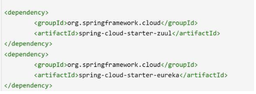
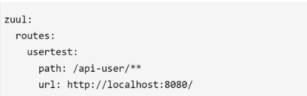
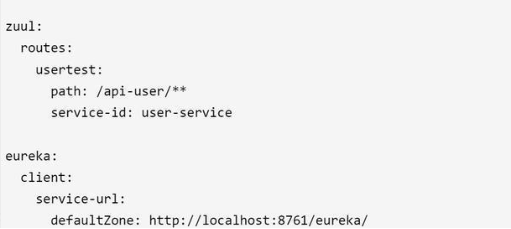
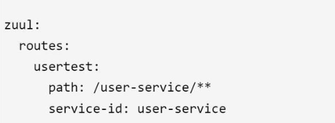
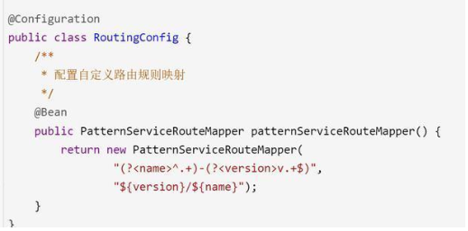
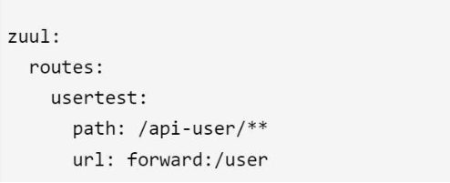

1 pom.xml引入依赖Jar

2 Zuul常用配置

2.1 URL方式配置

以上配置含义：所有符合/api-user/**规则的访问都会将路由到转发到http://localhost:8080地址上，也就是说，当我们访问http://localhost:9999/api-user/getAllUser的时候，API网关服务会将该请求路由到http://localhost:8080/getAllUser提供的微服务接口上。

usertest是该路由规则的名称，可以随意定义。

这种配置使用较少，不能使用Ribbon负载均衡和Hystrix熔断，仍然需要人工来维护path和具体url的关系。

2.2 面向服务路由配置

Zuul与Eureka做了无缝整合，可以让路由的path不映射到具体的url，而是让其映射到具体的服务，Eureka来负责将服务与url来做映射。

以上配置含义：所有符合/api-user/**规则的访问都会路由到名为user-service的服务上，user-service是微服务应用配置项"spring.application.name"所指定并注册在Eureka中，该服务可能会有多个实例，由Ribbon自动路由到具体的微服务实例上。

需要配置Eureka服务注册中心

这种方式更常用，不需要维护具体的URL

2.3 Zuul默认路由规则

Zuul默认路由规则的path会使用service-id配置的服务名作为请求前缀，如访问http://localhost:9999/user-service/getUser会自动路由到service-id为user-service的微服务实例中，规则如下：

Zuul这样做是为了简化我们的配置，毕竟通过service-id来访问微服务在实际情况中普遍存在。如果不想使用默认路由规则，只需要配置ignored-services=*。

2.4 自定义路由映射规则

该示例是将userservice-v1映射到/v1/uservice/中，常用于版本管理中，如APP端调用的API带有版本信息(服务-版本)，Zuul为这些不同版本的微服务应用生成以版本代号作为路由前缀定义的路由规则。

通过具有版本号前缀的URL路径，可以很容易通过路径表达式来归类和管理这些具有版本信息的微服务

2.5 本地跳转

Zuul支持将请求跳转到Zuul自身提供服务中，通过在url中指定forward即可，如http://localhost:9999/api-user/getUser，会直接访问zuul应用中的user/getUser服务

