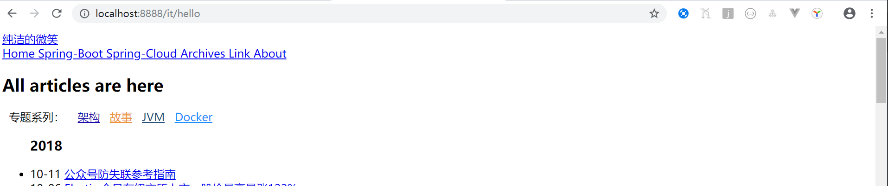
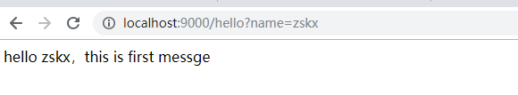
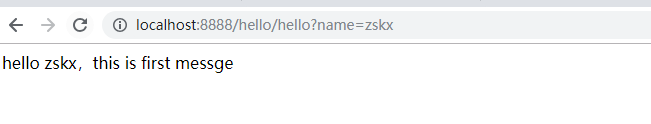
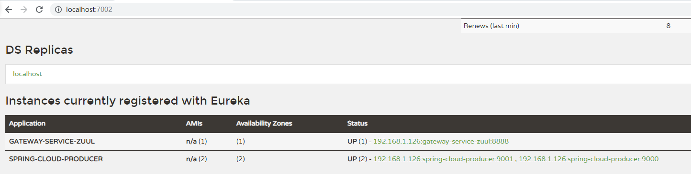

## 单zuul项目启动、网关转发

1 application.properties配置

```m
server.port=8888

#\u8FD9\u91CC\u7684\u914D\u7F6E\u8868\u793A\uFF0C\u8BBF\u95EE/it/** \u76F4\u63A5\u91CD\u5B9A\u5411\u5230http://www.ityouknow.com/**
zuul.routes.it.path=/it/**
zuul.routes.it.url=http://www.ityouknow.com

zuul.routes.hello.path=/hello/**
zuul.routes.hello.url=http://localhost:9000/
```
2 定义了2个转发:
    
2.1 凡是localhost:8888/it/** 的请求，全部指向 `http://www.ityouknow.com`

 

2.2 凡是localhost:8888/hello/** 的请求，全部指向到 9000端口的项目
如：`http://localhost:8888/hello/hello?name=zskx`  指向 `http://localhost:9000/hello?name=zskx`





## 将网关项目单独抽离出来，接入springCloud

1 项目准备

网关服务项目  GATEWAY-SERVICE-ZUUL
接入springCloud的其他服务 SPRING-CLOUD-PRODUCER 有2个实例，分别是9000和9001


2 网关信息配置

```m
spring.application.name=gateway-service-zuul
server.port=8888

zuul.routes.producer.path=/producer/**
zuul.routes.producer.serviceId=spring-cloud-producer

eureka.client.serviceUrl.defaultZone=http://localhost:7002/eureka/
```
将localhost:8888/producer/** 的请求转向到 服务名为 spring-cloud-producer 的某个实例下(多个实例Ribbon会自动路由到具体的实例)
如请求：`http://localhost:8888/producer/hello?name=zskx` 会随机到 `http://localhost:9000/hello?name=zskx` 或者 `http://localhost:9001/hello?name=zskx`


