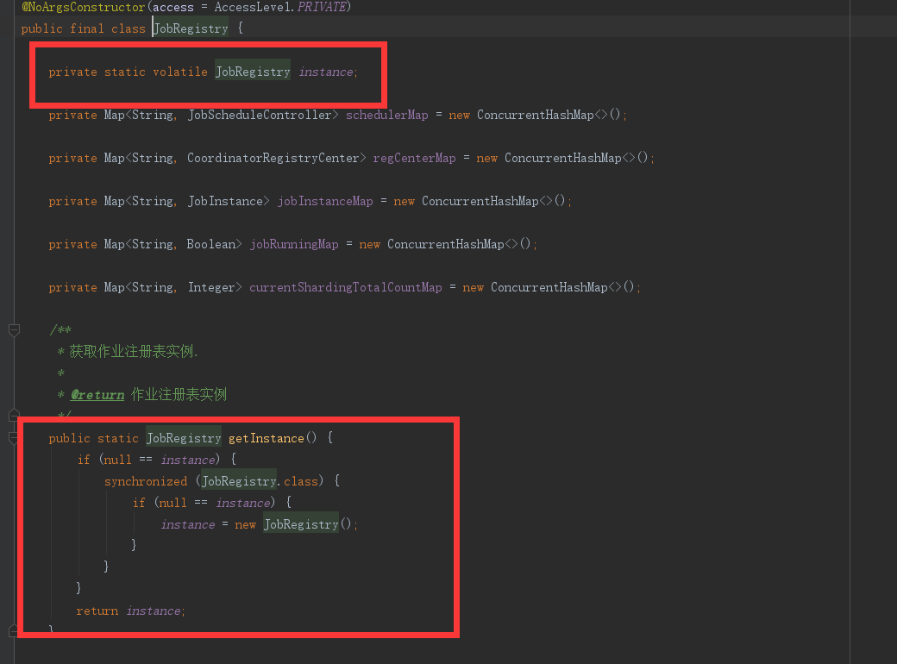
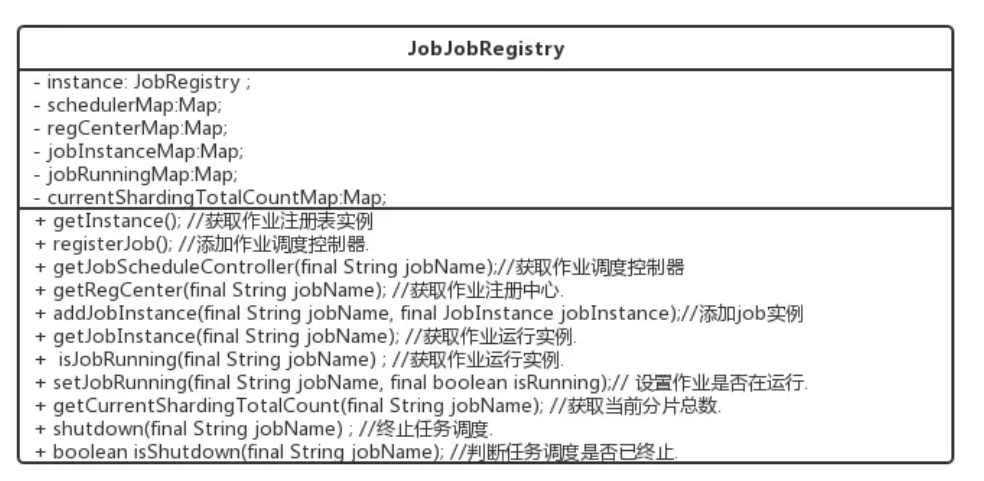

三种不同类型的作业完成基本的参数组装之后，都是交给JobScheduler这个对象的init()方法去统一初始化
```java
/**
    * 初始化作业.
    */
public void init() {
    LiteJobConfiguration liteJobConfigFromRegCenter = schedulerFacade.updateJobConfiguration(liteJobConfig);
    JobRegistry.getInstance().setCurrentShardingTotalCount(liteJobConfigFromRegCenter.getJobName(), liteJobConfigFromRegCenter.getTypeConfig().getCoreConfig().getShardingTotalCount());
    JobScheduleController jobScheduleController = new JobScheduleController(
            createScheduler(), createJobDetail(liteJobConfigFromRegCenter.getTypeConfig().getJobClass()), liteJobConfigFromRegCenter.getJobName());
    JobRegistry.getInstance().registerJob(liteJobConfigFromRegCenter.getJobName(), jobScheduleController, regCenter);
    schedulerFacade.registerStartUpInfo(!liteJobConfigFromRegCenter.isDisabled());
    jobScheduleController.scheduleJob(liteJobConfigFromRegCenter.getTypeConfig().getCoreConfig().getCron());
}
```

作业注册之前，会将job任务统一交由注册器JobRegistry统一管理，JobRegistry对象保存有job注册的所有信息，且从名字可以看出，该对象是单例;

JobRegistry 用到了单例模式的双向检查




看JobRegistry的API，能看到每一个job都有一个对应的job实例，和一个jobSchedulerController(作业控制器)，这就和example实例中的javaMain类中的代码相互论证，setUpDataflowJob，setUpDataflowJob，setUpScriptJob中都new 了一个新的JobScheduler，而jobSchduler中new了一个新的SchedulerFacade(原来以为会和quartz的集群方案一样，共用一个Scheduler，看来是自己想错了，elasticJob中每个作业都有一个Scheduler)。 ElasticJobListener是job监控的listener，后面再单独讲，这里带过，然后组装数据。


## 初始化流程

```java
/**
    * 初始化作业.
    */
public void init() {
    LiteJobConfiguration liteJobConfigFromRegCenter = schedulerFacade.updateJobConfiguration(liteJobConfig);
    JobRegistry.getInstance().setCurrentShardingTotalCount(liteJobConfigFromRegCenter.getJobName(), liteJobConfigFromRegCenter.getTypeConfig().getCoreConfig().getShardingTotalCount());
    JobScheduleController jobScheduleController = new JobScheduleController(
            createScheduler(), createJobDetail(liteJobConfigFromRegCenter.getTypeConfig().getJobClass()), liteJobConfigFromRegCenter.getJobName());
    JobRegistry.getInstance().registerJob(liteJobConfigFromRegCenter.getJobName(), jobScheduleController, regCenter);
    schedulerFacade.registerStartUpInfo(!liteJobConfigFromRegCenter.isDisabled());
    jobScheduleController.scheduleJob(liteJobConfigFromRegCenter.getTypeConfig().getCoreConfig().getCron());
}
```

首先，启动的时候，会将job的配置信息通过scheduler传递给configService服务通过zk保存或更新最新的配置信息，然后将job的分片参数，jobSchdulerController注册到JobRegistry单例对象里，上面已经提到，所有的job相关的信息都是通过单例JobRegistry对象去统一管理的,registerStartUpInfo方法中通过不同的服务，做了不同服务的几件事情，启动所有的作业监听服务，选举主节点，持久化服务器上线服务，重新分片等，看代码

```java
    /**
     * 注册作业启动信息.
     * 
     * @param enabled 作业是否启用
     */
    public void registerStartUpInfo(final boolean enabled) {
        listenerManager.startAllListeners();
        leaderService.electLeader();
        serverService.persistOnline(enabled);
        instanceService.persistOnline();
        shardingService.setReshardingFlag();
        monitorService.listen();
        if (!reconcileService.isRunning()) {
            reconcileService.startAsync();
        }
    }
```
然后看到JobSchdulerController.scheduleJob，只看scheduleJob方法名，答案已经很明显了，在这个方法中会去启动quartz的scheduler。从init代码中初始化JobScheduleController对象得知，每初始化一个JobScheduleController，就会创建一个新的quartz的Scheduler，也就是说一个job对应一个quartz的scheduler，一个quartz的scheduler对应一个job，一一对应。

```java
/**
    * 调度作业.
    * 
    * @param cron CRON表达式
    */
public void scheduleJob(final String cron) {
    try {
        if (!scheduler.checkExists(jobDetail.getKey())) {
            scheduler.scheduleJob(jobDetail, createTrigger(cron));
        }
        scheduler.start();
    } catch (final SchedulerException ex) {
        throw new JobSystemException(ex);
    }
}
```