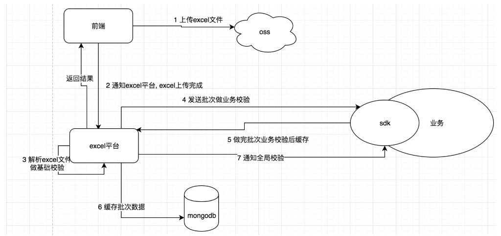
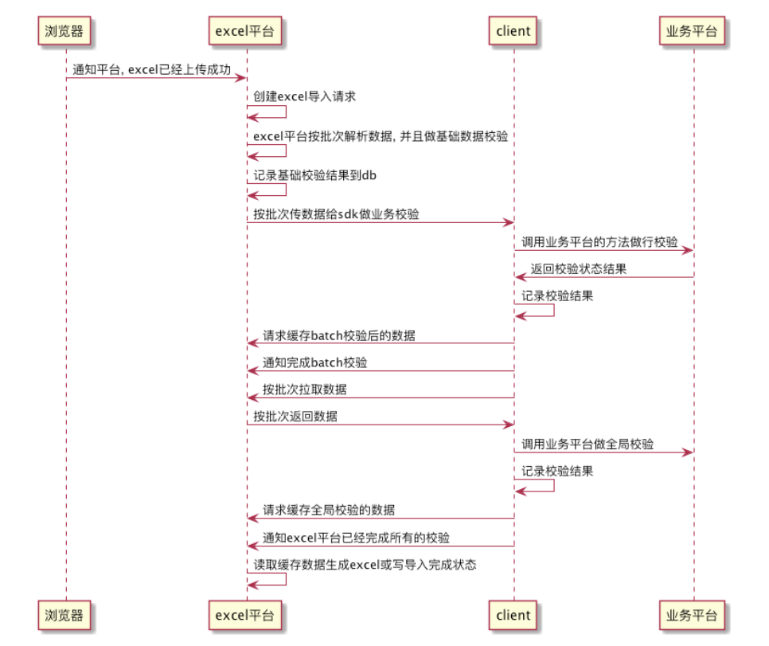
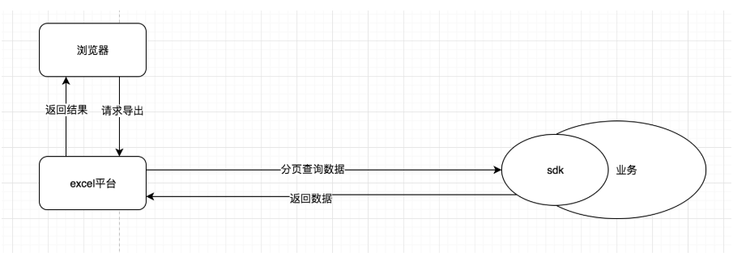
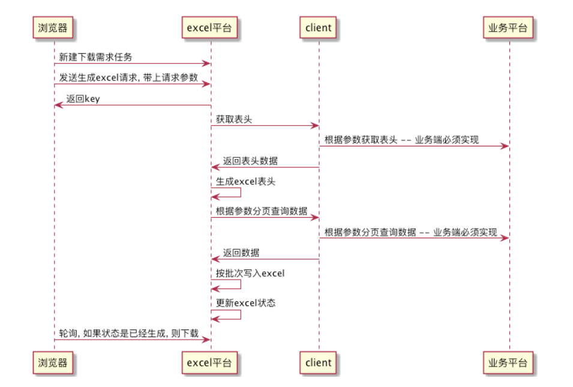
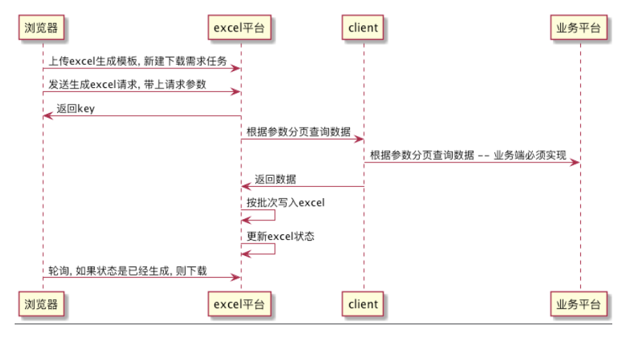
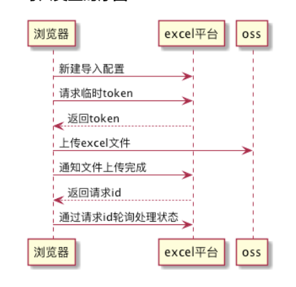
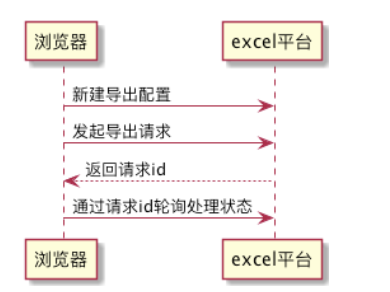
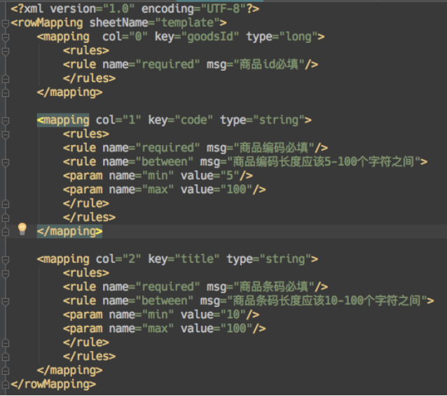

# 一 背景

    在我们的后台系统中存在着各种各样的导入导出业务需求, 且导入导出时excel的上传下载解析生成的过程都是重复繁琐的, 所以我们开发人员在做开发时, 总是避免不了这些重复性的代码, 并且业务代码中还会夹杂着无关业务的excel处理流程. 除此外, 每个导入导出都是在各自的服务中处理, 如果数据量大就会影响到当前服务的性能, 上传\下载excel还会占用当前服务器的宽带, excel处理时间过长会超时, 如果增对每个业务需求的导入导出都做优化处理, 会增加开发难度.  为了解决这一些系列问题, 我们将excel导入导出抽成一个单独的服务 (excel处理平台).

# 二 excel处理平台介绍

## 1 excel平台如何处理上述问题

    a. 请求导步化(解决超时问题)

    b. excel分批次处理(解决大数据量问题)

    c. sdk封装通信流程(简化业务开发)

    d. excel直接上传oss(解决宽带占用)

    e. excel处理独立于业务之外(解决excel处理影响服务的问题)

    f. 统一excel处理接口(方便前端组件实现)

    g. 基础校验配置化(减少业务代码的重复的基础校验)

## 2 excel平台目前实现的功能

    a. 导入excel, 做业务处理, 不返回任保结果, 如果校验出错则提供excel下载

    b. 导入excel, 返回导入的数据, 如果校验出错则提供excel下载

    c. 按查询条件导出excel

    d. 按查询条件动态表头导出excel

## 三 excel平台设计概述

### 1 导入流程

####导入流程说明

        1\ 在excel平台页面上新建导入配置, 上传xml解析文件, excel下载模板, 错误导入模板等, 填写业务唯一的code

        2\ 前端上传excel到oss后, 通知excel平台开始处理

        3\ 前端轮询excel平台的处理状态

        4\ excel平台开始处理, 先按批次解析excel并且做基础校验 , 然后按批次发送到sdk给业务端做业务校验, sdk校验完后再调用excel平台缓存数据到mongodb,

           等所有批次完成业务验后, 再给sdk发送一个finish的全局校验, sdk做全局校验时调用excel平台拉取数据

####导入流程拓扑图

    
#### 导入流程时序图
   

### 2导出流程
####导出程拓扑图

      
####导出流程时序图

#####动态表头

 

#####固定表头

### 3 浏览器与excel平台的校互

##### 导入交互时序图

##### 导出交互时序图

## 四 excel平台详细设计(具体请看代码)

###### 1excel的xml解析文件设计
通过xml的配置, 可以将数据按照对应的key封装好给业务端, 并且可以配置数据的类型和校验规则

    

###### 2基础校验组件设计

    基础校验组件主要是excel的文xml配置件中rules的标签. 

    rule主要配置名称和对应的错误信息, 还有一些需要的参数.

    rule可以配置多个, 目前系统只支持 必填\正则匹配\等于三个校验, 如果有业务其他需要, 可以添加校验器.

    因为基础校验主要在excel平台上完成的, 因些暂时无法sdk上自由扩展校验器, 必须在excel平台项目上开发.

    具体详看: com.laimi.platform.common.validator.ValidatorRegister

        

###### 3excel 文件SAX事件通知解析

    引用一下: 

        在Office 2007之前，Office一直都是以二进制位的方式存储，但这种格式不易被其它软件拿来使用，在各界的压力下，MicroSoft于2005年发布了基于XML的ooxml开放文档标准。ooxml的xml schema强调减少load time，增快parsing speed，将child elements分开存储，而不是multiple attributes一起存，这有点类似于HTML的结构。ooxml 使用XML和ZIP技术结合进行文件存储，因为XML是一个基于文本的格式，而且ZIP容器支持内容的压缩，所以其一大优势就是可以大大减小文件的尺寸。.

    

    excel的本质是xml, 我们平常用poi解析excel时, 都是用加载dom方式将整个excel载入内存再做解析的,    数据量不大的情况下这种方式挺方便, 当excel上的数据量大到一定时, 加载整个excel可能使得内存溢出, 所以为更好的地处理大批量数据解析, excel平台引入了poi 的SAX解析api来做分批解析处理.

具体详看: com.laimi.platform.jxls.ExcelParser

###### 4 导出按excel模板渲染设计

    导出模板设计, 主要是通过在excel模板中写好渲染的key进行写入数据. 为了能按指定条件对相应的单元格进行样式渲染, 我们引入了ongl表达式.

    

###### 5 异步异常统一处理设计

    异步处理中,  当未处理异常抛出, 我们通过一个统一的处理, 将异常记录到当前请求中, 并且将流程中断, 当前端请求状态时, 我们直接抛出相应的异常给controller.

    详见: com.laimi.platform.exception.LaimiAsyncUncaughtExceptionHandler

######6 sdk设计

    业务端引入sdk后, 项目启动后, sdk获取本地项目的一些配置信息向excel平台注册. 

    当sdk注册完后, excel平台便根据服务名和code进行调用sdk所在的服务.

    所有的业务实现只需要sdk提供的ImportService和ExportService便可以进行导入导出业务处理.

    sdk会将数据按照给定的范型封装成bean给业务方, 且屏蔽通信过程

    具体详见: com.laimi.platform.sdk包

## 五 excel平台遇到的问题

    1 excel配置文件的处理, 体验不好,  每次上线前要保存好配置文件, 且等上线后还要重新配置

    2 异步化不好搞

    3 虽然在excel平台上的导入导出上都做了批次处理, 但是在使用过程中还是避免不了要对全部数据进行聚合统计

        如:做全局校验的时候

    4 sdk的设计没经验

##后言:

     excel虽然上线了, 但只是做了两个基础的导入导出功能, 有部分功能测试没有完全复盖, 如果在使用过程中遇到坑, 请及时通知修改, 如果对导入导出有特殊的要求也可以提出, 方便我们进行第二第三期的开发

[execl平台接入文档](http://24a03699.wiz03.com/share/s/0AE3qp3i9kO727pPzC2DcbNJ2JTWrr1uWk132BcCBB3UO3xq)

 

