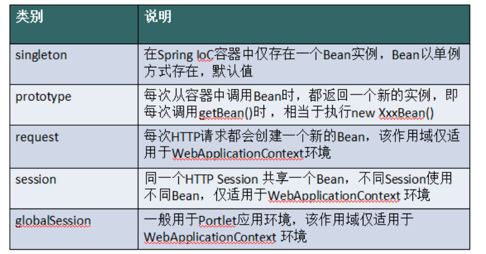
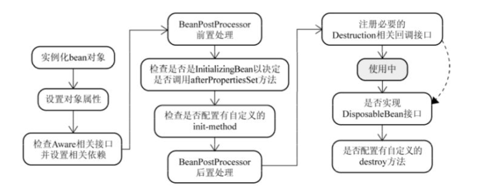

## bean的作用域

    五种作用域中，request、session 和 global session 三种作用域仅在基于web的应用中使用（不必关心你所采用的是什么web应用框架），只能用在基于 web 的 Spring ApplicationContext 环境。

## Spring Bean的生命周期是这样纸的：

    Bean容器找到配置文件中 Spring Bean 的定义。
    
    Bean容器利用Java Reflection API创建一个Bean的实例。
    
    如果涉及到一些属性值 利用set方法设置一些属性值。
    
    如果Bean实现了BeanNameAware接口，调用setBeanName()方法，传入Bean的名字。
    如果Bean实现了BeanClassLoaderAware接口，调用setBeanClassLoader()方法，传入ClassLoader对象的实例。
    如果Bean实现了BeanFactoryAware接口，调用setBeanClassLoader()方法，传入ClassLoader对象的实例。
    与上面的类似，如果实现了其他*Aware接口，就调用相应的方法。

    如果有和加载这个Bean的Spring容器相关的BeanPostProcessor对象，执行postProcessBeforeInitialization()方法
    如果Bean实现了InitializingBean接口，执行afterPropertiesSet()方法。

    如果Bean在配置文件中的定义包含init-method属性，执行指定的方法。    
    如果有和加载这个Bean的Spring容器相关的BeanPostProcessor对象，执行postProcessAfterInitialization()方法
    
    当要销毁Bean的时候，如果Bean实现了DisposableBean接口，执行destroy()方法。
    当要销毁Bean的时候，如果Bean在配置文件中的定义包含destroy-method属性，执行指定的方法。

    