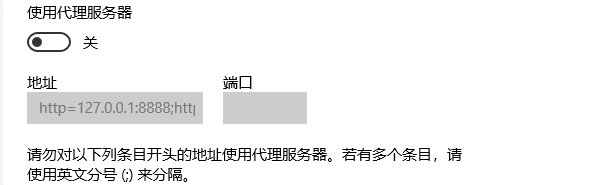

##  下载的ppt 无法用powerpoint打开 提示要修复；点击也没效果

    打开ppt -> 选项 -> 信任中心 -> 信任中心设置 -> 受信任位置 -> 添加

## 代理服务器

## Rsync
lanping/1234567890

config.sh:  LOCAL_PROJECT_PATH="D:\lanPingCode\iswx_erp_auto_parts"

chmod +x target/build/bin/*

Host gitee.com
    HostName gitee.com
    Port 22

Host git.oschina.net
    HostName git.oschina.net
    Port 22

Host github.com
	HostName github.com
	Port 22

Host 115.28.89.39
 	HostName 115.28.89.39
 	Port 9527	

#zskx 使用的端口S
Host *
    port 33984
