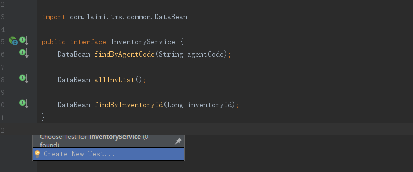
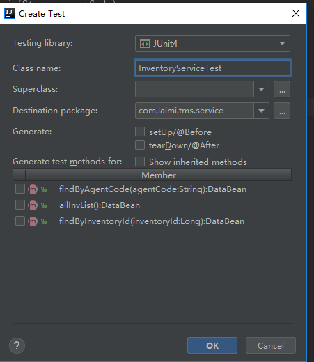

# Service层单元测试

当前service下，Ctrl+Shift+T(Window)





将生成对应的service的测试
# Controller层单元测试
MockMvc实现了对Http请求的模拟，能够直接使用网络的形式，转换到Controller的调用，这样可以使得测试速度快、不依赖网络环境，而且提供了一套验证的工具，这样可以使得请求的验证统一而且很方便。

## Controller
```java
package com.dudu.controller;

/** 教程页面
 * Created by tengj on 2017/3/13.
 */
@Controller
@RequestMapping("/learn")
public class LearnController  extends AbstractController{
    @Autowired
    private LearnService learnService;
    private Logger logger = LoggerFactory.getLogger(this.getClass());

    @RequestMapping("")
    public String learn(Model model){
        model.addAttribute("ctx", getContextPath()+"/");
        return "learn-resource";
    }

    /**
     * 查询教程列表
     * @param page
     * @return
     */
    @RequestMapping(value = "/queryLeanList",method = RequestMethod.POST)
    @ResponseBody
    public AjaxObject queryLearnList(Page<LeanQueryLeanListReq> page){
        List<LearnResource> learnList=learnService.queryLearnResouceList(page);
        PageInfo<LearnResource> pageInfo =new PageInfo<LearnResource>(learnList);
        return AjaxObject.ok().put("page", pageInfo);
    }

    /**
     * 新添教程
     * @param learn
     */
    @RequestMapping(value = "/add",method = RequestMethod.POST)
    @ResponseBody
    public AjaxObject addLearn(@RequestBody LearnResource learn){
        learnService.save(learn);
        return AjaxObject.ok();
    }

    /**
     * 修改教程
     * @param learn
     */
    @RequestMapping(value = "/update",method = RequestMethod.POST)
    @ResponseBody
    public AjaxObject updateLearn(@RequestBody LearnResource learn){
        learnService.updateNotNull(learn);
        return AjaxObject.ok();
    }

    /**
     * 删除教程
     * @param ids
     */
    @RequestMapping(value="/delete",method = RequestMethod.POST)
    @ResponseBody
    public AjaxObject deleteLearn(@RequestBody Long[] ids){
        learnService.deleteBatch(ids);
        return AjaxObject.ok();
    }

    /**
     * 获取教程
     * @param id
     */
    @RequestMapping(value="/resource/{id}",method = RequestMethod.GET)
    @ResponseBody
    public LearnResource qryLearn(@PathVariable(value = "id") Long id){
       LearnResource lean= learnService.selectByKey(id);
        return lean;
    }
}
```

## 自动创建一个croller的测试类
```java
package com.dudu.controller;

import com.dudu.domain.User;
import org.junit.Before;
import org.junit.Test;
import org.junit.runner.RunWith;
import org.springframework.beans.factory.annotation.Autowired;
import org.springframework.boot.test.context.SpringBootTest;
import org.springframework.http.MediaType;
import org.springframework.mock.web.MockHttpSession;
import org.springframework.test.context.junit4.SpringRunner;
import org.springframework.test.web.servlet.MockMvc;
import org.springframework.test.web.servlet.request.MockMvcRequestBuilders;
import org.springframework.test.web.servlet.result.MockMvcResultHandlers;
import org.springframework.test.web.servlet.result.MockMvcResultMatchers;
import org.springframework.test.web.servlet.setup.MockMvcBuilders;
import org.springframework.web.context.WebApplicationContext;

@RunWith(SpringRunner.class)
@SpringBootTest

public class LearnControllerTest {
    @Autowired
    private WebApplicationContext wac;

    private MockMvc mvc;
    private MockHttpSession session;


    @Before
    public void setupMockMvc(){
        mvc = MockMvcBuilders.webAppContextSetup(wac).build(); //初始化MockMvc对象
        session = new MockHttpSession();
        User user =new User("root","root");
        session.setAttribute("user",user); //拦截器那边会判断用户是否登录，所以这里注入一个用户
    }

    /**
     * 新增教程测试用例
     * @throws Exception
     */
    @Test
    public void addLearn() throws Exception{
        String json="{\"author\":\"HAHAHAA\",\"title\":\"Spring\",\"url\":\"http://tengj.top/\"}";
        mvc.perform(MockMvcRequestBuilders.post("/learn/add")
                    .accept(MediaType.APPLICATION_JSON_UTF8)
                    .content(json.getBytes()) //传json参数
                    .session(session)
            )
           .andExpect(MockMvcResultMatchers.status().isOk())
           .andDo(MockMvcResultHandlers.print());
    }

    /**
     * 获取教程测试用例
     * @throws Exception
     */
    @Test
    public void qryLearn() throws Exception {
        mvc.perform(MockMvcRequestBuilders.get("/learn/resource/1001")
                    .contentType(MediaType.APPLICATION_JSON_UTF8)
                    .accept(MediaType.APPLICATION_JSON_UTF8)
                    .session(session)
            )
           .andExpect(MockMvcResultMatchers.status().isOk())
           .andExpect(MockMvcResultMatchers.jsonPath("$.author").value("嘟嘟MD独立博客"))
           .andExpect(MockMvcResultMatchers.jsonPath("$.title").value("Spring Boot干货系列"))
           .andDo(MockMvcResultHandlers.print());
    }

    /**
     * 修改教程测试用例
     * @throws Exception
     */
    @Test
    public void updateLearn() throws Exception{
        String json="{\"author\":\"测试修改\",\"id\":1031,\"title\":\"Spring Boot干货系列\",\"url\":\"http://tengj.top/\"}";
        mvc.perform(MockMvcRequestBuilders.post("/learn/update")
                .accept(MediaType.APPLICATION_JSON_UTF8)
                .content(json.getBytes())//传json参数
                .session(session)
        )
                .andExpect(MockMvcResultMatchers.status().isOk())
                .andDo(MockMvcResultHandlers.print());
    }

    /**
     * 删除教程测试用例
     * @throws Exception
     */
    @Test
    public void deleteLearn() throws Exception{
        String json="[1031]";
        mvc.perform(MockMvcRequestBuilders.post("/learn/delete")
                .accept(MediaType.APPLICATION_JSON_UTF8)
                .content(json.getBytes())//传json参数
                .session(session)
        )
                .andExpect(MockMvcResultMatchers.status().isOk())
                .andDo(MockMvcResultHandlers.print());
    }

}
```


## MockMvc的时候需要先用MockMvcBuilders使用构建MockMvc对象
```java
@Before
public void setupMockMvc(){
    mvc = MockMvcBuilders.webAppContextSetup(wac).build(); //初始化MockMvc对象
    session = new MockHttpSession();
    User user =new User("root","root");
    session.setAttribute("user",user); //拦截器那边会判断用户是否登录，所以这里注入一个用户
}
```
## MockMvc简单的方法
```java
/**
 * 获取教程测试用例
 * @throws Exception
 */
@Test
public void qryLearn() throws Exception {
    mvc.perform(MockMvcRequestBuilders.get("/learn/resource/1001")
                .contentType(MediaType.APPLICATION_JSON_UTF8)
                .accept(MediaType.APPLICATION_JSON_UTF8)
                .session(session)
        )
       .andExpect(MockMvcResultMatchers.status().isOk())
       .andExpect(MockMvcResultMatchers.jsonPath("$.author").value("嘟嘟MD独立博客"))
       .andExpect(MockMvcResultMatchers.jsonPath("$.title").value("Spring Boot干货系列"))
       .andDo(MockMvcResultHandlers.print());
}
```
    mockMvc.perform执行一个请求
    MockMvcRequestBuilders.get(“/user/1”)构造一个请求，Post请求就用.post方法
    contentType(MediaType.APPLICATION_JSON_UTF8)代表发送端发送的数据格式是application/json;charset=UTF-8
    accept(MediaType.APPLICATION_JSON_UTF8)代表客户端希望接受的数据类型为application/json;charset=UTF-8
    session(session)注入一个session，这样拦截器才可以通过
    ResultActions.andExpect添加执行完成后的断言
    ResultActions.andExpect(MockMvcResultMatchers.status().isOk())方法看请求的状态响应码是否为200如果不是则抛异常，测试不通过
    andExpect(MockMvcResultMatchers.jsonPath(“$.author”).value(“嘟嘟MD独立博客”))这里jsonPath用来获取author字段比对是否为嘟嘟MD独立博客,不是就测试不通过
    ResultActions.andDo添加一个结果处理器，表示要对结果做点什么事情，比如此处使用MockMvcResultHandlers.print()输出整个响应结果信息

# 新断言assertThat使用

## assertThat 的基本语法
```java
assertThat( [value], [matcher statement] );
```
    value 是接下来想要测试的变量值；
    matcher statement 是使用 Hamcrest 匹配符来表达的对前面变量所期望的值的声明，如果 value 值与 matcher statement 所表达的期望值相符，则测试成功，否则测试失败

## 匹配符
```java
字符相关匹配符
/**equalTo匹配符断言被测的testedValue等于expectedValue，
* equalTo可以断言数值之间，字符串之间和对象之间是否相等，相当于Object的equals方法
*/
assertThat(testedValue, equalTo(expectedValue));
/**equalToIgnoringCase匹配符断言被测的字符串testedString
*在忽略大小写的情况下等于expectedString
*/
assertThat(testedString, equalToIgnoringCase(expectedString));
/**equalToIgnoringWhiteSpace匹配符断言被测的字符串testedString
*在忽略头尾的任意个空格的情况下等于expectedString，
*注意：字符串中的空格不能被忽略
*/
assertThat(testedString, equalToIgnoringWhiteSpace(expectedString);
/**containsString匹配符断言被测的字符串testedString包含子字符串subString**/
assertThat(testedString, containsString(subString) );
/**endsWith匹配符断言被测的字符串testedString以子字符串suffix结尾*/
assertThat(testedString, endsWith(suffix));
/**startsWith匹配符断言被测的字符串testedString以子字符串prefix开始*/
assertThat(testedString, startsWith(prefix));
一般匹配符
/**nullValue()匹配符断言被测object的值为null*/
assertThat(object,nullValue());
/**notNullValue()匹配符断言被测object的值不为null*/
assertThat(object,notNullValue());
/**is匹配符断言被测的object等于后面给出匹配表达式*/
assertThat(testedString, is(equalTo(expectedValue)));
/**is匹配符简写应用之一，is(equalTo(x))的简写，断言testedValue等于expectedValue*/
assertThat(testedValue, is(expectedValue));
/**is匹配符简写应用之二，is(instanceOf(SomeClass.class))的简写，
*断言testedObject为Cheddar的实例
*/
assertThat(testedObject, is(Cheddar.class));
/**not匹配符和is匹配符正好相反，断言被测的object不等于后面给出的object*/
assertThat(testedString, not(expectedString));
/**allOf匹配符断言符合所有条件，相当于“与”（&&）*/
assertThat(testedNumber, allOf( greaterThan(8), lessThan(16) ) );
/**anyOf匹配符断言符合条件之一，相当于“或”（||）*/
assertThat(testedNumber, anyOf( greaterThan(16), lessThan(8) ) );
数值相关匹配符
/**closeTo匹配符断言被测的浮点型数testedDouble在20.0¡À0.5范围之内*/
assertThat(testedDouble, closeTo( 20.0, 0.5 ));
/**greaterThan匹配符断言被测的数值testedNumber大于16.0*/
assertThat(testedNumber, greaterThan(16.0));
/** lessThan匹配符断言被测的数值testedNumber小于16.0*/
assertThat(testedNumber, lessThan (16.0));
/** greaterThanOrEqualTo匹配符断言被测的数值testedNumber大于等于16.0*/
assertThat(testedNumber, greaterThanOrEqualTo (16.0));
/** lessThanOrEqualTo匹配符断言被测的testedNumber小于等于16.0*/
assertThat(testedNumber, lessThanOrEqualTo (16.0));
集合相关匹配符
/**hasEntry匹配符断言被测的Map对象mapObject含有一个键值为"key"对应元素值为"value"的Entry项*/
assertThat(mapObject, hasEntry("key", "value" ) );
/**hasItem匹配符表明被测的迭代对象iterableObject含有元素element项则测试通过*/
assertThat(iterableObject, hasItem (element));
/** hasKey匹配符断言被测的Map对象mapObject含有键值“key”*/
assertThat(mapObject, hasKey ("key"));
/** hasValue匹配符断言被测的Map对象mapObject含有元素值value*/
assertThat(mapObject, hasValue(value));
```    
# 单元测试的回滚
单元个测试的时候如果不想造成垃圾数据，可以开启事物功能，记在方法或者类头部添加@Transactional注解即可

```java
@Test
@Transactional
public void add(){
    LearnResource bean = new LearnResource();
    bean.setAuthor("测试回滚");
    bean.setTitle("回滚用例");
    bean.setUrl("http://tengj.top");
    learnService.save(bean);
}
```
    这样测试完数据就会回滚了，不会造成垃圾数据。如果你想关闭回滚，只要加上@Rollback(false)注解即可。@Rollback表示事务执行完回滚，支持传入一个参数value，默认true即回滚，false不回滚。